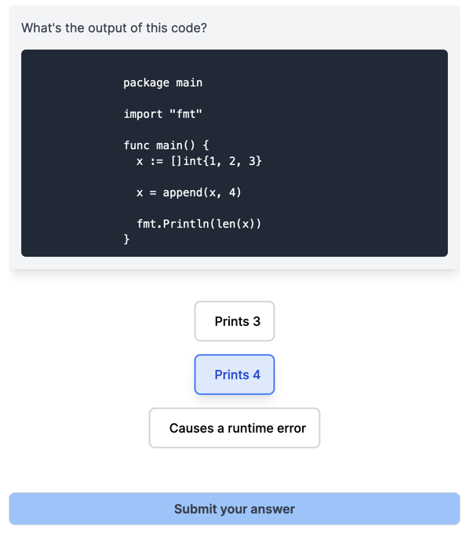

# GoLearn

This is an Anthropic Hackathon project to help users learn Go. It works by showing users a snippet of GoLang code and getting them to respond to a multiple choice answer.

When users answer a question correctly, their difficulty score increases. This leads the app to generate a more difficult question in the next round.

When they answer a question incorrectly, the tool records the concepts that they may be weak in, and will ask them more questions about it in the next round.

## How to run

1. Clone this repo
2. Run `npm install`
3. Run `npm dev`
